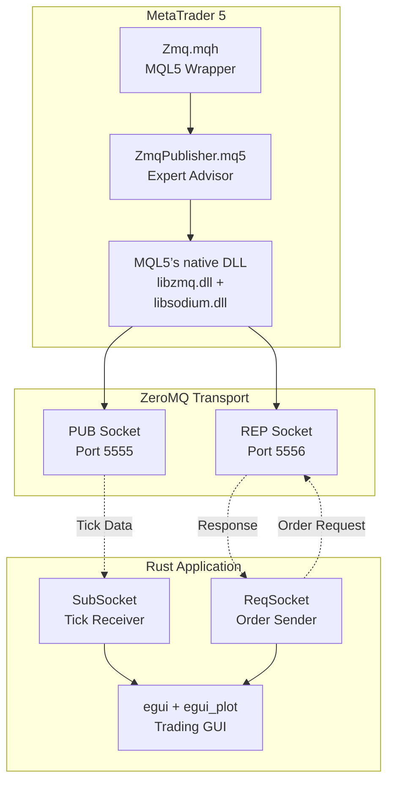

# System Overview Architecture

> **Figure for**: Section III (Methodology) — System Architecture  
> **Suggested caption**: "SUM3API three-layer system architecture"  
> **LaTeX label**: `fig:system_overview`

