# Security & Authentication Flow

> **Figure for**: Section III-D (Security Architecture)  
> **Suggested caption**: "Credential isolation through session inheritance"  
> **LaTeX label**: `fig:security_flow`

```mermaid
sequenceDiagram
    participant User
    participant MT5 as MT5 Terminal
    participant Broker as Broker Server
    participant EA as Expert Advisor
    participant ZMQ as ZeroMQ
    participant Rust as Rust App

    rect rgb(255, 245, 220)
        Note over User,Broker: Phase 1: Manual Authentication
        User->>MT5: Enter credentials<br/>(account + password + server)
        MT5->>Broker: Authenticate
        Broker-->>MT5: Session granted
    end

    rect rgb(220, 245, 220)
        Note over MT5,EA: Phase 2: Session Inheritance
        MT5->>EA: OnInit() — inherits session
        Note over EA: No credentials stored<br/>Full API access granted
    end

    rect rgb(220, 230, 255)
        Note over EA,Rust: Phase 3: Credential-Free IPC
        EA->>ZMQ: Bind PUB :5555 + REP :5556
        Rust->>ZMQ: Connect SUB + REQ
        Note over ZMQ: localhost only<br/>No credentials transmitted
    end

    rect rgb(255, 230, 230)
        Note over EA,Rust: Phase 4: Runtime Operations
        EA->>ZMQ: Publish {balance, equity, ...}
        ZMQ-->>Rust: Receive (no auth needed)
        Rust->>ZMQ: Send order request
        ZMQ-->>EA: Execute via CTrade
    end
```

