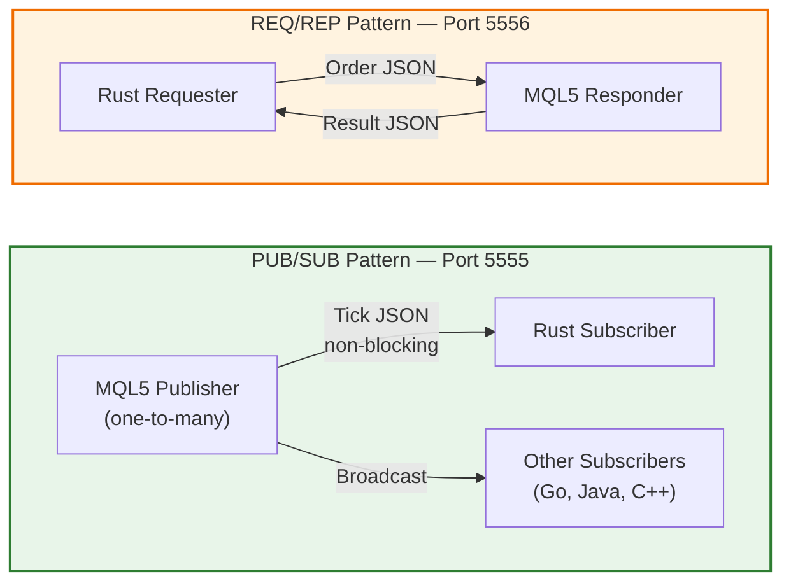

# ZeroMQ Communication Layer

> **Figure for**: Section III-B (Communication Architecture)  
> **Suggested caption**: "Dual-socket ZeroMQ communication patterns"  
> **LaTeX label**: `fig:zmq_patterns`

