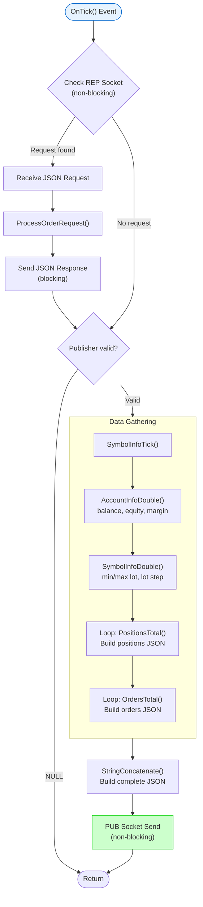

# MQL5 Expert Advisor Internal Flow

> **Figure for**: Section IV-A (MQL5 Implementation Details)  
> **Suggested caption**: "Expert Advisor OnTick() processing flow"  
> **LaTeX label**: `fig:ea_flow`

