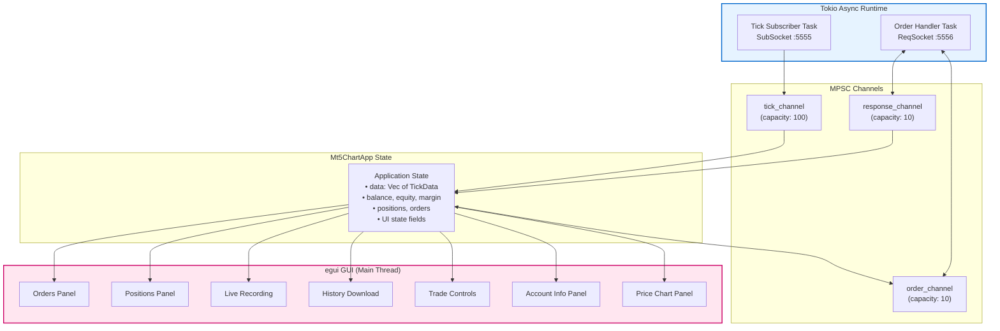

# Rust Application Architecture

> **Figure for**: Section III-C (Rust Application Architecture)  
> **Suggested caption**: "Tokio async runtime and MPSC channel architecture"  
> **LaTeX label**: `fig:rust_arch`

