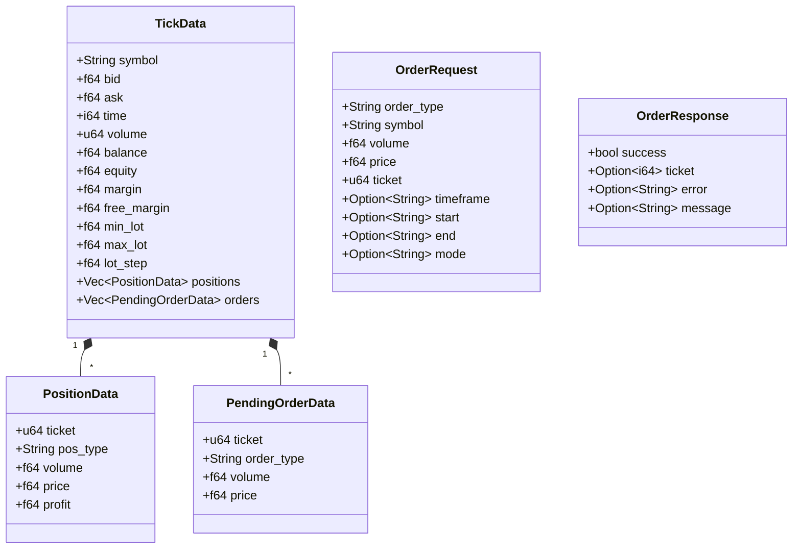

# Data Structures & Type Hierarchy

> **Figure for**: Section IV-B (Rust Implementation — Data Structures)  
> **Suggested caption**: "MQL5-to-Rust data structure mapping"  
> **LaTeX label**: `fig:data_structures`

