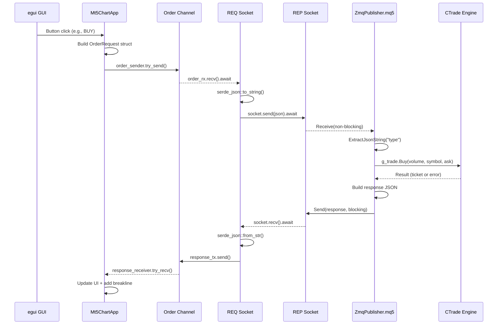

# Order Execution Pipeline

> **Figure for**: Section IV-A (Order Processing)  
> **Suggested caption**: "End-to-end order execution sequence"  
> **LaTeX label**: `fig:order_exec`

```mermaid
sequenceDiagram
    participant GUI as egui GUI
    participant APP as Mt5ChartApp
    participant CH as Order Channel
    participant REQ as REQ Socket
    participant REP as REP Socket
    participant EA as ZmqPublisher.mq5
    participant MT5 as CTrade Engine

    GUI->>APP: Button click (e.g., BUY)
    APP->>APP: Build OrderRequest struct
    APP->>CH: order_sender.try_send()

    CH-->>REQ: order_rx.recv().await
    REQ->>REQ: serde_json::to_string()
    REQ->>REP: socket.send(json).await

    REP-->>EA: Receive(non-blocking)
    EA->>EA: ExtractJsonString("type")
    EA->>MT5: g_trade.Buy(volume, symbol, ask)
    MT5-->>EA: Result (ticket or error)
    EA->>EA: Build response JSON
    EA->>REP: Send(response, blocking)

    REP-->>REQ: socket.recv().await
    REQ->>REQ: serde_json::from_str()
    REQ->>CH: response_tx.send()
    CH-->>APP: response_receiver.try_recv()
    APP->>APP: Update UI + add breakline
```
