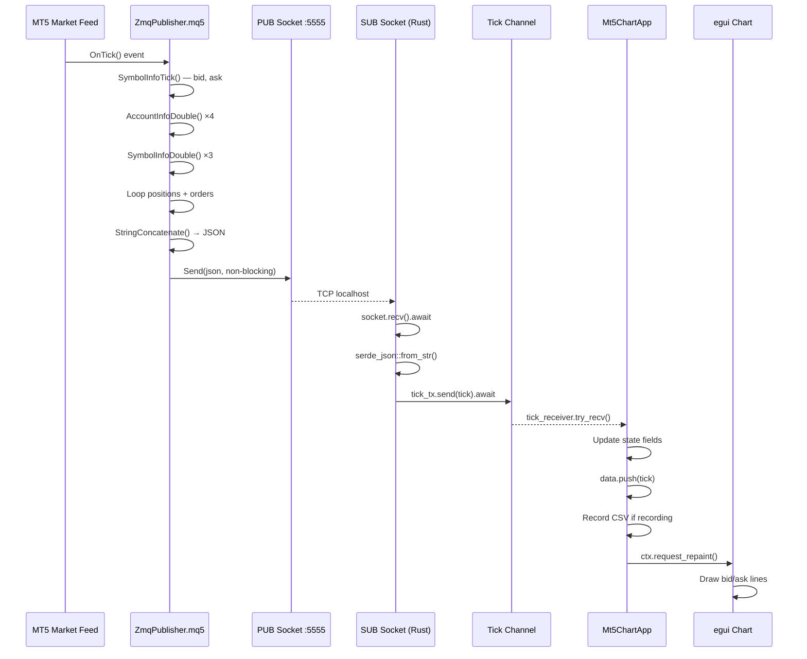

# Tick Data Pipeline

> **Figure for**: Section IV (Implementation — Tick Publishing)  
> **Suggested caption**: "Real-time tick data streaming pipeline"  
> **LaTeX label**: `fig:tick_pipeline`

```mermaid
sequenceDiagram
    participant MKT as MT5 Market Feed
    participant EA as ZmqPublisher.mq5
    participant PUB as PUB Socket :5555
    participant SUB as SUB Socket (Rust)
    participant CH as Tick Channel
    participant APP as Mt5ChartApp
    participant GUI as egui Chart

    MKT->>EA: OnTick() event
    EA->>EA: SymbolInfoTick() — bid, ask
    EA->>EA: AccountInfoDouble() ×4
    EA->>EA: SymbolInfoDouble() ×3
    EA->>EA: Loop positions + orders
    EA->>EA: StringConcatenate() → JSON
    EA->>PUB: Send(json, non-blocking)

    PUB-->>SUB: TCP localhost
    SUB->>SUB: socket.recv().await
    SUB->>SUB: serde_json::from_str()
    SUB->>CH: tick_tx.send(tick).await

    CH-->>APP: tick_receiver.try_recv()
    APP->>APP: Update state fields
    APP->>APP: data.push(tick)
    APP->>APP: Record CSV if recording
    APP->>GUI: ctx.request_repaint()
    GUI->>GUI: Draw bid/ask lines
```
