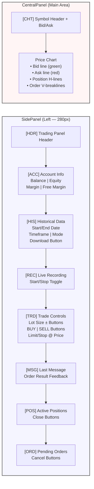

# GUI Component Layout

> **Figure for**: Section IV-B (GUI Implementation)  
> **Suggested caption**: "Trading terminal GUI component layout"  
> **LaTeX label**: `fig:gui_layout`

```mermaid
flowchart LR
    subgraph SIDE["SidePanel (Left — 280px)"]
        direction TB
        A1["[HDR] Trading Panel Header"]
        A2["[ACC] Account Info<br/>Balance | Equity<br/>Margin | Free Margin"]
        A3["[HIS] Historical Data<br/>Start/End Date<br/>Timeframe | Mode<br/>Download Button"]
        A4["[REC] Live Recording<br/>Start/Stop Toggle"]
        A5["[TRD] Trade Controls<br/>Lot Size ± Buttons<br/>BUY | SELL Buttons<br/>Limit/Stop @ Price"]
        A6["[MSG] Last Message<br/>Order Result Feedback"]
        A7["[POS] Active Positions<br/>Close Buttons"]
        A8["[ORD] Pending Orders<br/>Cancel Buttons"]

        A1 --> A2 --> A3 --> A4
        A4 --> A5 --> A6 --> A7 --> A8
    end

    subgraph CENTER["CentralPanel (Main Area)"]
        direction TB
        B1["[CHT] Symbol Header + Bid/Ask"]
        B2["Price Chart<br/>• Bid line (green)<br/>• Ask line (red)<br/>• Position H-lines<br/>• Order V-breaklines"]
        B1 --> B2
    end

    style SIDE fill:#f5f5ff,stroke:#666,stroke-width:2px
    style CENTER fill:#fff5f5,stroke:#666,stroke-width:2px
```
