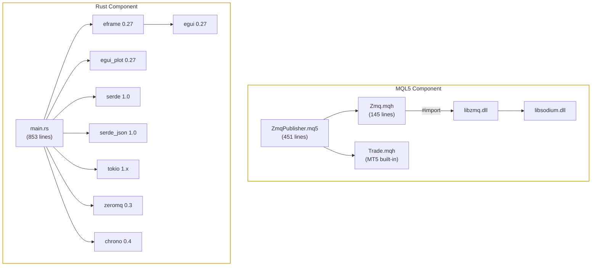

# Dependency Graph

> **Figure for**: Section IV (Implementation — Dependencies)  
> **Suggested caption**: "File-level dependency graph for MQL5 and Rust components"  
> **LaTeX label**: `fig:dependency_graph`

